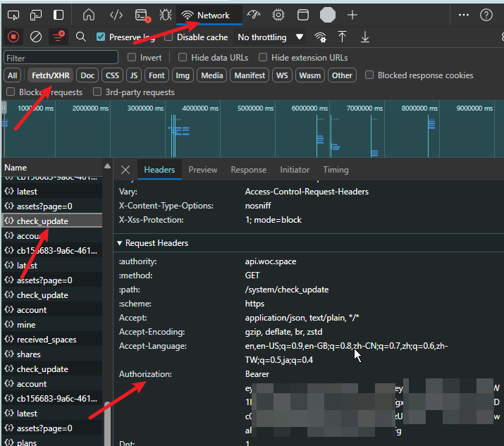

# WOC! PY!

[https://woc.space](https://woc.space/)的命令行版本, 可以直接拿去集成到其他工具里<br>
现在支持的功能不多, 有空说不定会继续做

## 使用方式
可以在 [release](https://github.com/ShiinaRinne/pywoc/releases) 下载可执行文件, 或者通过源码运行
```
PS D:\Desktop\woc> woc.exe -h
usage: main.py [-h] [--login LOGIN] [--list-space] [--upload] [--shell] [files ...]

Woc! Py!!!

positional arguments:
  files          需要上传的文件列表

options:
  -h, --help     show this help message and exit
  --login LOGIN  使用auth bearer 啥的登录。参数为那个token, 从网页f12复制即可, 之后会保存到本地就不需要了. 例如 woc --login 'Bearer eyJ0xxxx'
  --list-space   显示当前的所有space
  --upload       需要上传的文件列表
  --shell        进入shell模式
```

## 示例
- 登录. 
    目前需要手动在浏览器 F12 中复制 `Bearer` token. 后面的所有操作都需要使用此命令登录后才可使用. <br>
    该命令会将 token 保存至 `C:\Users\<user>\AppData\Local\woc_token` 文件中

    步骤: 
    1. `F12/ Ctrl Shift I/ Command Shift I` 打开开发者工具
    2. `Network` 页 
    3. 筛选 `Fetch/XHR` 请求 
    4. 随便点一个查看 `request header` 中的 `Authorization` 字段并全部复制
    5. 
    ```
    woc.exe login "Bearer eyJxxxxx"
    ```

- 显示当前 Space 列表
    ```
    PS D:\Desktop\woc> woc.exe --list-space
    name         guid                                 size     entityAmount ownerName      expireAt
    1234         cb15xxxx-xxxx-4617-xxxx1-xxxxxxx6abb2 8191325  15           I am a creator 2025-06-29T05:09:42.964+00:00
    ```

- 上传文件. 多文件时使用空格分隔
    ```
    woc.exe --upload foo.jpg bar.png
    ```
    或者
    ```
    woc.exe foo.jpg bar.png
    ```
- Shell 模式. 目前支持的命令不多
  ```
  login: 登录. 可以带个 token 作为参数. 例如 login "bearer xxxx"
  lss: list space. 显示当前的所有 space
  lsf: list file. 显示当前 space 下的所有文件
  upload: 上传文件. 例如 upload foo.jpg bar.png
  cd: 用于在多个 space 时切换, 影响 lsf, upload 等命令
  exit: 退出
  ```
  ```
  woc.exe --shell
  >>> lsf
    当前 space:1234 page: 1/1
    FqtwljFaQAAkHn-.jpg(1)(1)(1)(1).jpg   https://static-prod.woc.space/xxxx神秘链接
    prometheus.png(1)(1)(1)(1).png   https://static-prod.woc.space/xxxx神秘链接
  >>> lss
    name         guid                                 size     entityAmount ownerName      expireAt
    1234         cb15xxxxxxxxxxxxxxxxxxxxxxxxxxxxxxxx 8191325  15           I am a creator 2025-06-29T05:09:42.964+00:00
    >>>